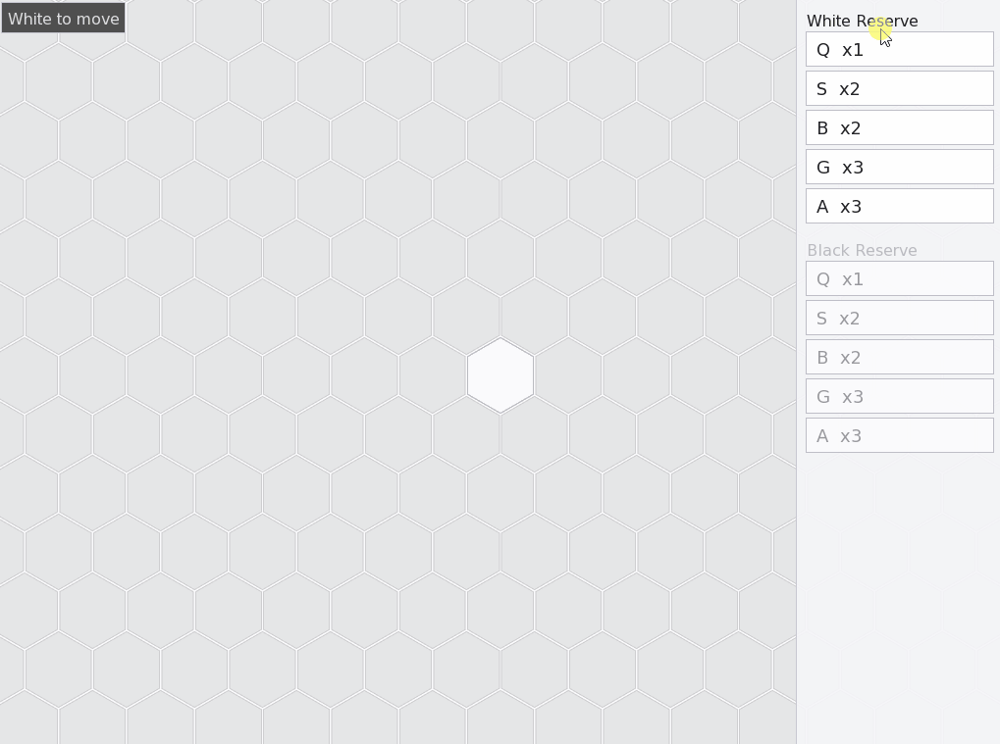

# 🐝 Hive Clone (C++20 + SFML)

A complete, open-source **unofficial implementation** of the award-winning board game *Hive*, built in modern **C++20** with a custom rules engine and an SFML desktop UI.



⚠️ **Disclaimer**: Hive is a copyrighted board game by Gen42 Games.  
This is a **fan project for educational purposes only**, not affiliated with or endorsed by Gen42.

---

## 💡 Why This Project Matters

This project connects directly to my professional experience in **embedded software**, **UI/HMI frameworks**, and **C++ development**:

- **C++20 + engine/UI separation** mirrors the design practices I used in automotive and medical HMI systems (Altia, Continental).  
- **Rules engine + unit tests** demonstrate my ability to design reliable, testable core logic — critical in regulated domains like automotive and medical devices.  
- **Hex-grid algorithms (BFS/DFS, connectivity checks)** showcase my ability to translate abstract requirements into concrete, efficient implementations.  
- **Graphics/UI polish with SFML** highlights cross-platform graphics programming, similar to the rendering and modular HMI work I led at Altia.  
- **Full game loop + turn enforcement** demonstrates end-to-end ownership: architecture, algorithms, UX, and testing.

---

## ✨ Features
- ✔️ **Complete ruleset** for base Hive (no expansions yet)  
  - Queen placement rule (must be placed by 4th turn)  
  - Turn order enforced (White → Black → White …)  
  - Legal moves: Queen slide, Grasshopper jumps, Ant BFS sliding, Spider 3-step DFS, Beetle climb & stacking  
  - Game over when a queen is fully surrounded (draws supported)  
- ✔️ **Piece tray** with remaining counts  
- ✔️ **Animated feedback**: teal rings for legal moves, hover gold outline, blue selected outline  
- ✔️ **Smooth zoom & pan** with anti-aliased hex grid  
- ✔️ **Unit tests** (GoogleTest) for all pieces + connectivity checks  

---

## 🕹️ Gameplay

### Piece Placement


### Piece Movement


### Game Over


---

## ⚙️ Build Instructions (Windows)

```bash
# clone
git clone https://github.com/<yourusername>/hive-clone.git
cd hive-clone

# configure (with tests enabled)
cmake -S . -B build -DHIVE_BUILD_TESTS=ON

# build (Debug or Release)
cmake --build build --config Debug

# run
build/bin/Debug/hive_desktop.exe
```

## 🧪 Running Tests
```bash
ctest --test-dir build -C Debug --output-on-failure
```

Unit tests cover:

- Queen moves
- Grasshopper jumps
- Ant sliding (bounded BFS)
- Spider exactly 3 steps (DFS)
- Beetle climb/slide
- Hive connectivity + queen surrounded

## 🔍 Technical Highlights

- C++20 features: structured bindings, lambdas, std::optional, unordered_map

- Hex-grid algorithms: BFS/DFS, hive connectivity checks

- SFML rendering: hardware-accelerated 2D graphics with anti-aliased hex grid

- Clean architecture: separated engine, rules, and UI layers

- Unit testing culture: GoogleTest integrated into the build

- CMake build system with FetchContent for dependencies

## 🚀 Roadmap

- Hive expansions (Ladybug, Mosquito, Pillbug)

- Simple AI opponent (minimax with heuristics)

- Online multiplayer (networking)

- Save/load game state

- Web build (Emscripten) or mobile port

## 📜 License

This project is licensed under the [MIT License](LICENSE).  
See the full text at [opensource.org/licenses/MIT](https://opensource.org/licenses/MIT).

⚠️ *Reminder: Hive is a copyrighted board game by Gen42 Games.  
This is an unofficial, fan-made clone created for educational purposes only.*
